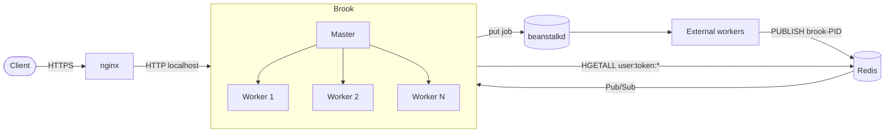

<div align="center">

# 🌊 BROOK

**A lightweight, high-performance HTTP server for job submission**


</div>

---

## 📖 About

**Brook** is an HTTP server written in C whose sole purpose is to receive requests, validate them and turn them into **jobs** for a [beanstalkd](https://beanstalkd.github.io/) queue. When an external worker has processed the job, the response travels back to Brook through Redis Pub/Sub and is returned to the original HTTP client.

Its architecture is inspired by **nginx**: a *master* process manages several *worker processes*, each running its own event loop based on `poll()` over file descriptors.

> ⚠️ **Important**
> Brook is designed to run **behind a reverse proxy (nginx)**. It does not serve static files, has no SSL/TLS, and only accepts connections on `localhost` (`127.0.0.1`).

## ✨ Features

- ⚡ **Non-blocking event loop** using `poll()`, up to 1024 simultaneous connections per worker
- 👷 **Multi-process**: master + N workers, with automatic respawn of workers that exit
- 🛡️ **Gatekeeper**: a JSON route table defining the method, tube, permissions and application of each endpoint
- 🔐 **Session authentication** (`token` cookie) validated against Redis
- 🎭 **Role-based access control** using hexadecimal *role masks*
- 🧩 **Multi-app**: one server can serve several applications, isolated by `product_key`
- 📨 **Job submission** to beanstalkd with automatic retry (up to 3 attempts)
- 🔁 **Asynchronous responses** from workers via Redis Pub/Sub, with custom status code, headers and body
- 🧹 **Graceful shutdown** on `SIGINT`/`SIGTERM`

## 🏗️ Architecture



### Request lifecycle

1. The client sends an HTTP request; nginx proxies it to Brook.
2. The HTTP **parser** reads the request (method, URL, query params, cookies, body).
3. The **gatekeeper** looks up the matching route and method. If none exists, the request is rejected.
4. If the route is **protected**:
   - the `token` is extracted from the cookie and its format validated;
   - the session is fetched from Redis (`HGETALL user:token:<token>`);
   - the session's role mask and `product_key` are checked against the route (`403` on mismatch).
5. Brook builds the **job payload** and submits it to the configured tube (`use` + `put`).
6. An external worker consumes the job and publishes the response on the Redis channel `brook-<pid>`.
7. Brook finds the connection by `job_id` and sends the HTTP response to the client.

### Processes

| Process | Role |
|---------|------|
| **Master** | Spawns the workers, watches them with `waitpid()` and respawns any that exit unexpectedly |
| **Worker** | Accepts connections, runs the event loop and keeps its own connections to beanstalkd and Redis (client + subscriber) |

Each worker identifies itself as `brook-<pid>` and subscribes to the Redis channel of that name, which lets external workers reply to the exact process that originated the job.

## 📁 Project structure

```
brook-http/
├── Makefile
├── config/
│   ├── broker.conf          # Main server configuration
│   ├── gatekeeper.json      # Route, job and permission definitions
│   └── README.md            # Detailed gatekeeper documentation
├── includes/
│   ├── core/                # Headers: config, socket, process, gatekeeper, redis, beanstalkd, logger...
│   └── http/                # Headers: request, response, session
├── src/
│   ├── brook.c              # Entry point (master process)
│   ├── core/                # Processes, sockets, connections, gatekeeper, redis, beanstalkd, logger
│   └── http/                # Request parser, responses and sessions
└── vscode_template/         # VS Code debug templates
```

## 🔧 Requirements

| Dependency | Used for |
|------------|----------|
| `gcc` + `make` | Building |
| [cJSON](https://github.com/DaveGamble/cJSON) | JSON parsing and generation |
| `libbeanstalkclient` | Asynchronous beanstalkd client |
| [hiredis](https://github.com/redis/hiredis) | Asynchronous Redis client |
| beanstalkd | Job queue server (runtime) |
| Redis | Sessions and response channel (runtime) |

On macOS the libraries are looked up in `/opt/homebrew`; on Linux in `/usr/local`.

```bash
# macOS (Homebrew)
brew install cjson hiredis beanstalkd redis
```

## 🚀 Build and install

```bash
make              # builds build/brook
sudo make install # installs to /usr/local/bin/brook
make clean        # removes the build/ directory
sudo make uninstall
```

## ▶️ Running

Brook takes the path to the configuration file as its only argument:

```bash
./build/brook config/broker.conf
```

Make sure **beanstalkd** and **Redis** are running before you start it.

## ⚙️ Configuration

### `broker.conf`

```yaml
name: "brook"
port: "6001"
workers: "4"
log: "/var/log/brook"
gatekeeper: "/etc/brook/gatekeeper.json"

beanstalkd:
  host: "127.0.0.1"
  port: "11300"

redis:
  host: "127.0.0.1"
  port: "6379"
```

| Key | Description |
|-----|-------------|
| `name` | Instance name |
| `port` | TCP port the server listens on (`127.0.0.1` only) |
| `workers` | Number of worker processes |
| `log` | Log directory/file |
| `gatekeeper` | Path to the JSON routes file |
| `beanstalkd.*` | beanstalkd host and port |
| `redis.*` | Redis host and port |

### nginx proxy example

```nginx
location /api/ {
    proxy_pass         http://127.0.0.1:6001/;
    proxy_set_header   Host $host;
    proxy_set_header   X-Real-IP $remote_addr;
}
```

## 🛡️ Gatekeeper

`gatekeeper.json` is an array of objects, each defining one endpoint. It is loaded into memory at startup into a search tree.

> Routes are matched by **exact URL** (no wildcards). Variable values must be sent as *query params*.

| Field | Required | Description |
|-------|:--------:|-------------|
| `method` | ✅ | List of accepted methods: `GET`, `POST`, `PUT`, `PATCH`, `DELETE` |
| `route` | ✅ | Endpoint path |
| `job.tube` | ✅ | beanstalkd tube the job is sent to |
| `job.*` | ➖ | The rest of the `job` block is forwarded to the worker as `options` (e.g. `attributes`) |
| `role_mask` | ➖ | Allowed roles, in hexadecimal. Makes the route **protected** |
| `product_key` | ➖ | Application the session must belong to |

### Public route

No session required. Any client can submit the job.

```json
{
  "method": ["POST"],
  "route": "/dx3/email",
  "job": { "tube": "dx3-mailer-ops" }
}
```

### Protected route

Requires a valid session and a permission match between the route's `role_mask` and the session's (bitwise `AND`).

```json
{
  "method": ["GET"],
  "route": "/storix/files",
  "role_mask": "0x1",
  "product_key": "storix",
  "job": { "tube": "storix-files-list" }
}
```

### Static job attributes

These let you identify where a request came from when several applications share the same authentication system:

```json
{
  "method": ["POST"],
  "route": "/url/example",
  "job": {
    "tube": "tube-name",
    "attributes": { "app": "web-app-name" }
  }
}
```

> More details in [`config/README.md`](config/README.md).

## 🔐 Sessions and authentication

Protected routes read the token from the `token` cookie:

```
Cookie: token=<user_id>-<86 base64 characters>==
```

The format is validated before any Redis access. The session is then loaded from a hash:

```
HGETALL user:token:<token>
```

| Redis field | Description |
|-------------|-------------|
| `user_id` | User ID (required, non-zero) |
| `user_roles` | Role mask in hexadecimal (required, non-zero) |
| `product_key` | Application the session belongs to (required) |
| `user_schema` | User schema (optional) |

### Error codes generated by Brook

| Status | Situation |
|:------:|-----------|
| `400` | Request body is not valid JSON |
| `401` | Missing or malformed token, expired session, or incomplete session |
| `403` | Role mask or `product_key` does not match the route |
| `500` | Error talking to Redis, or failure to enqueue the job (after 3 attempts) |

## 📨 Contract with external workers

### Job sent to beanstalkd

```json
{
  "channel": "brook-12345",
  "session": {
    "user_id": 42,
    "role_mask": 1,
    "product_key": "storix",
    "schema": "tenant_a"
  },
  "payload": { "...": "request body (POST/PATCH)" },
  "params":  { "key": "value" },
  "options": { "tube": "storix-files-list", "attributes": { } }
}
```

| Field | Present when |
|-------|--------------|
| `channel` | Always — the Redis channel the worker must reply on |
| `session` | The request has a session (protected route) |
| `payload` | `POST`/`PATCH` with a JSON body |
| `params` | The URL has query params |
| `options` | Always — the contents of the gatekeeper's `job` block |

Job defaults: priority `1024`, TTR `1000s`, delay `0`, up to `3` `put` attempts.

### Response published to Redis

The external worker must `PUBLISH` to the received `channel` with:

```json
{
  "job_id": 123,
  "status": 200,
  "headers": {
    "Set-Cookie": ["token=...; HttpOnly; Path=/"]
  },
  "payload": { "...": "response body" }
}
```

`job_id` is the ID returned by beanstalkd and is used to match the response to the right HTTP connection. Header values can be either a *string* or an *array* of *strings*.

## 🐞 Debugging

`vscode_template/` contains `launch.json`, `tasks.json` and `c_cpp_properties.json` files ready to copy into `.vscode/`. Building with `-DDEBUG_VSCODE` runs a **single** worker inside the main process, which makes breakpoints easier to use.

## 🗺️ Current status

- [x] HTTP parser, sockets and event loop
- [x] Multi-process with respawn
- [x] Gatekeeper with role mask and `product_key`
- [x] Redis-backed sessions
- [x] Job submission and asynchronous response
- [ ] Fully documented static attribute injection
- [ ] Dynamic route support (currently exact URL only)

---

<div align="center">
Made with ☕ and C
</div>
